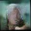

About
=====

Implementation BEGAN([Boundary Equilibrium Generative Adversarial Networks](https://arxiv.org/pdf/1703.10717.pdf)) by Keras.

Version
-------
Developed by these software versions.

* Mac OS Sierra: 10.12.4
* Python: 3.5.3
* Keras: 2.0.3
* Theano: 0.9.0
* Pillow: 4.1.0


How to Use
=======

Setup
--------

```bash
pip install -r requirements.txt
```

Create Dataset
------------

### Prepare Image
You can use any square images.
For example, 

images in [http://vis-www.cs.umass.edu/lfw/](http://vis-www.cs.umass.edu/lfw/)  

```text
[new] All images aligned with deep funneling 
(111MB, md5sum 68331da3eb755a505a502b5aacb3c201)
```

### Convert Images to 64x64 pixels

#### Install imagemagick
For `convert` command, install imagemagick.

```bash
brew install imagemagick
```

#### Convert Images
* `ORIGINAL_IMAGE_DIR`: dir of original JPG images
* `TARGET_DIR`: dir of after converted images

```bash
ORIGINAL_IMAGE_DIR=PATH/TO/ORIGINAL/IMAGE_DIR
CONVERTED_DIR=PATH/TO/CONVERTED/IMAGE_DIR

mkdir -p "$CONVERTED_DIR"
for f in $(find "$ORIGINAL_IMAGE_DIR" -name '*.jpg')
do
  echo "$f"
  convert "$f" -resize 64x64 ${CONVERTED_DIR}/$(basename $f)
done
```

#### Create Dataset

```bash
PYTHONPATH=src python src/began/create_dataset.py "$CONVERTED_DIR"
```

Training BEGAN
--------------

```bash
PYTHONPATH=src python src/began/training.py
```

Images are generated in each epoch into `generated/epXXX/` directory.

### Training History


### FYI: epoch time in training

About 680 sec/epoch

* Linux
* Dataset: `All images aligned with deep funneling` (13194 samples)
* Intel(R) Core(TM) i7-7700K CPU @ 4.20GHz
* GeForce GTX 1080
* Environment Variables

  ```bash
  KERAS_BACKEND=theano
  THEANO_FLAGS=device=gpu,floatX=float32,lib.cnmem=1.0
  ```

Generate Image
---------------

```bash
PYTHONPATH=src python src/began/generate_image.py
```

Generated images are outputted in `generated/main/` directory.

### Generated Image Examples

<table>
<tr>
  <th>Epoch 1</th>
  <th></th>
  <th></th>
  <th></th>
  <th></th>
  <th></th>
</tr>
<tr>
  <th>Epoch 25</th>
  <th></th>
  <th></th>
  <th></th>
  <th></th>
  <th></th>
</tr>
<tr>
  <th>Epoch 50</th>
  <th></th>
  <th></th>
  <th></th>
  <th></th>
  <th></th>
</tr>
<tr>
  <th>Epoch 75</th>
  <th></th>
  <th></th>
  <th></th>
  <th></th>
  <th></th>
</tr>
<tr>
  <th>Epoch 100</th>
  <th></th>
  <th></th>
  <th></th>
  <th></th>
  <th></th>
</tr>
<tr>
  <th>Epoch 125</th>
  <th></th>
  <th></th>
  <th></th>
  <th></th>
  <th></th>
</tr>
<tr>
  <th>Epoch 150</th>
  <th></th>
  <th></th>
  <th></th>
  <th></th>
  <th></th>
</tr>
<tr>
  <th>Epoch 175</th>
  <th></th>
  <th></th>
  <th></th>
  <th></th>
  <th></th>
</tr>
<tr>
  <th>Epoch 200</th>
  <th></th>
  <th></th>
  <th></th>
  <th></th>
  <th></th>
</tr>
<tr>
  <th>Epoch 215</th>
  <th></th>
  <th></th>
  <th></th>
  <th></th>
  <th></th>
</tr>
</table>

more filters or layers?


Memo
========

Trouble: Running with Theano 0.9.0 CPU mode on Linux
-------------
Theano 0.9.0 CPU mode on Linux seems to have memory leak problem.
See: https://github.com/fchollet/keras/issues/5935


